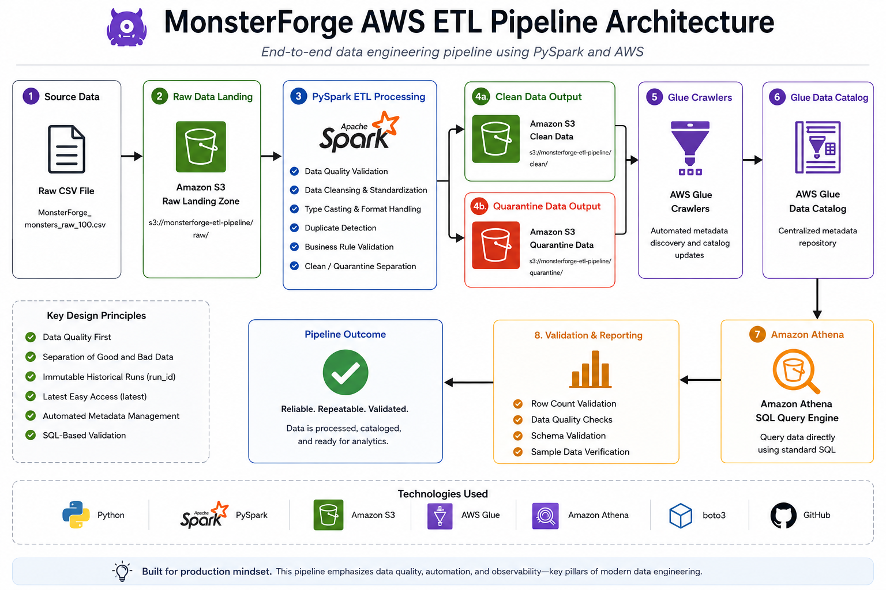
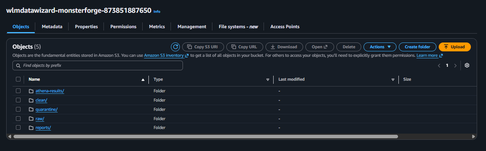
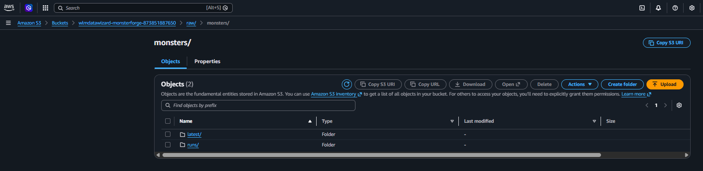
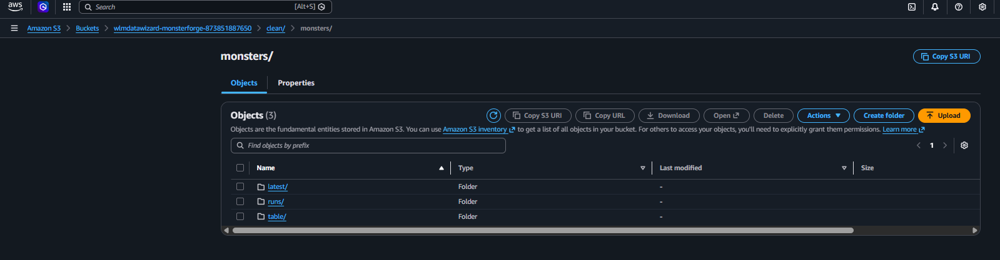
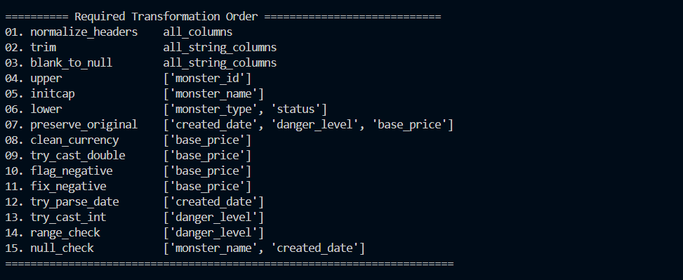
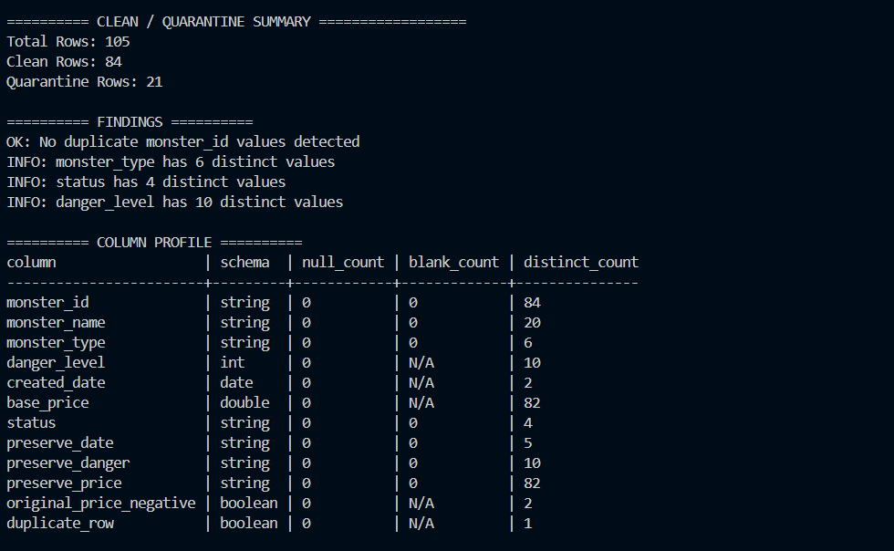
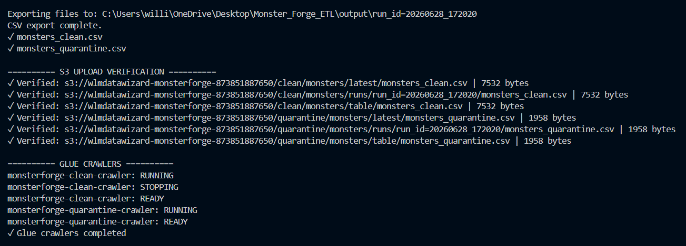

# MonsterForge AWS ETL Pipeline

> **An end-to-end AWS Data Engineering project demonstrating a production-style ETL pipeline built with PySpark, Amazon S3, AWS Glue, Amazon Athena, and boto3.**

---

## Project Highlights

- End-to-end ETL pipeline using PySpark
- Automated data quality validation
- Clean / Quarantine data processing
- Versioned data lake architecture (`latest` + `run_id`)
- AWS Glue Data Catalog automation
- Amazon Athena validation queries
- Modular, reusable Python design
- Centralized AWS error handling

---

## Architecture

---

## Amazon S3 Data Lake

The ETL pipeline organizes data into separate storage zones for raw ingestion, clean datasets, quarantined records, reporting, and Athena query results.

### S3 Bucket Layout

### Raw Zone

### Clean Zone

### Quarantine Zone

### Reports Zone

---

## Pipeline Features & AWS Integration

- Amazon S3 uploads
- Object verification
- Versioned storage
- AWS Glue crawler automation
- AWS Glue Data Catalog
- Amazon Athena validation

### Terminal Output

#### Pre-Transformation Quality Report

#### Raw Dataset Preview

---

## Data Quality Transformations

- Header normalization
- Whitespace trimming
- Blank value normalization
- Duplicate detection
- Invalid record quarantine
- Multi-format date parsing
- Currency normalization
- Negative value correction
- Data type validation

#### Transformation Pipeline

---

## Example Pipeline Output

#### Clean Dataset

#### Clean / Quarantine Summary

#### S3 Upload Verification

#### Athena Validation & Pipeline Completion

---

## Technologies

| Category | Technology |
|----------|------------|
| Language | Python |
| Processing | PySpark |
| Cloud | Amazon Web Services (AWS) |
| Storage | Amazon S3 |
| Metadata Catalog | AWS Glue |
| Query Engine | Amazon Athena |
| SDK | boto3 |
| Version Control | Git & GitHub |

---

## Engineering Decisions

A few design decisions intentionally mirror production ETL pipelines:

- Every pipeline execution generates a unique `run_id` for data lineage.
- Clean and quarantined datasets are written independently.
- The `latest` folder provides a stable endpoint for downstream consumers.
- Historical pipeline runs are preserved for auditing and traceability.
- All AWS interactions are centralized through a reusable error-handling wrapper.
- Amazon Athena performs post-load validation after the AWS Glue Data Catalog has been updated.

---

## Future Enhancements

Planned improvements include:

- Environment-based configuration
- Structured logging
- Automated quality report generation
- Apache Airflow orchestration
- AWS Lambda event triggers
- Amazon Redshift integration
- Infrastructure as Code (Terraform)

---

## About

This project was built as part of my transition into Data Engineering with the goal of demonstrating practical experience designing, automating, and validating cloud-native ETL pipelines using modern AWS services.

The focus of this repository is on building reliable, maintainable, and production-oriented data engineering workflows rather than performing downstream analytics.