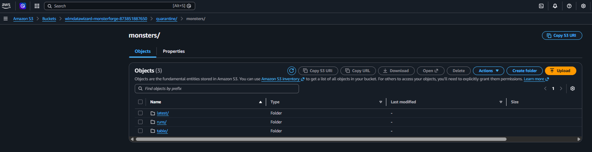
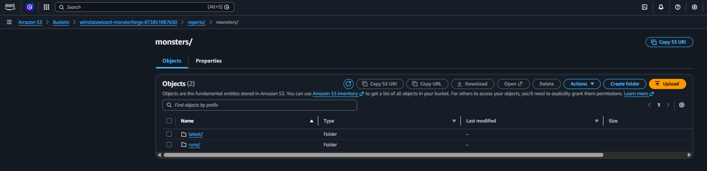
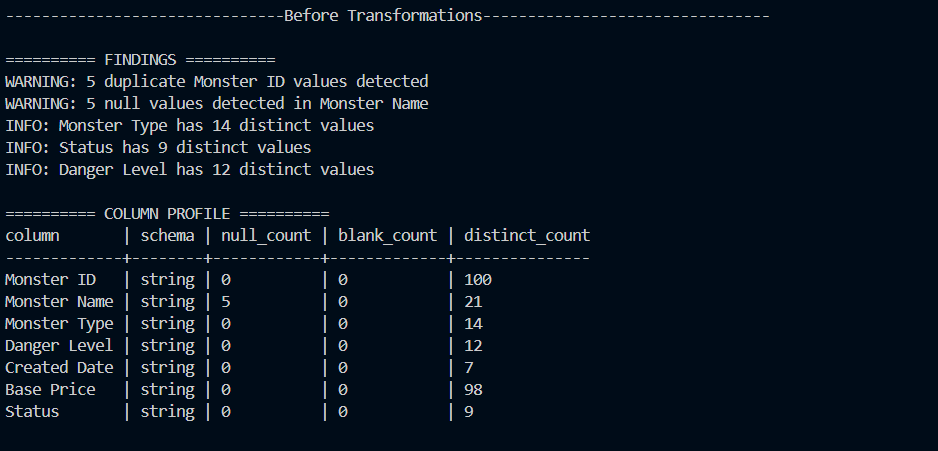
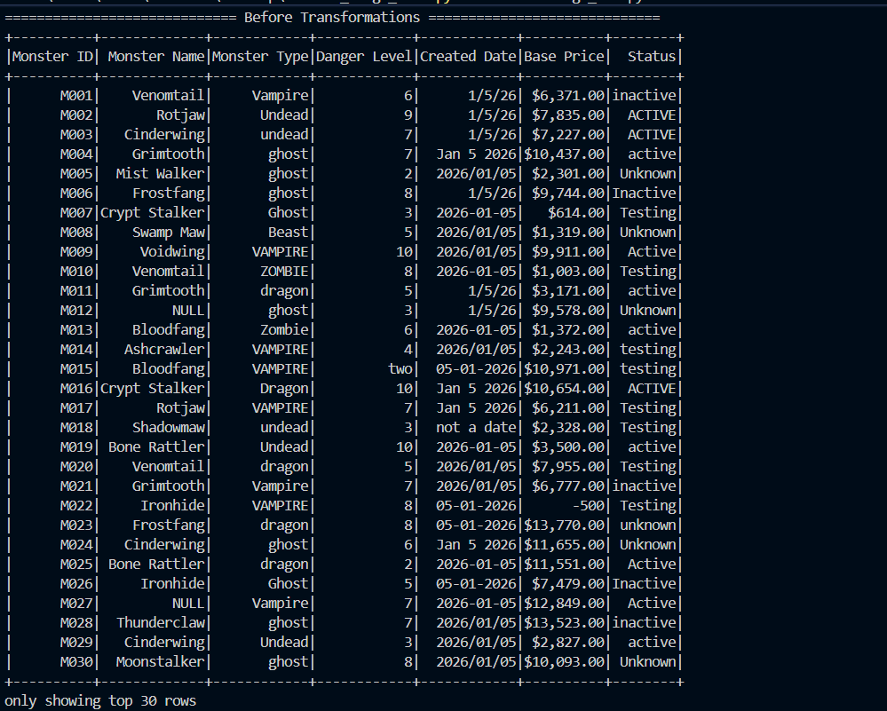
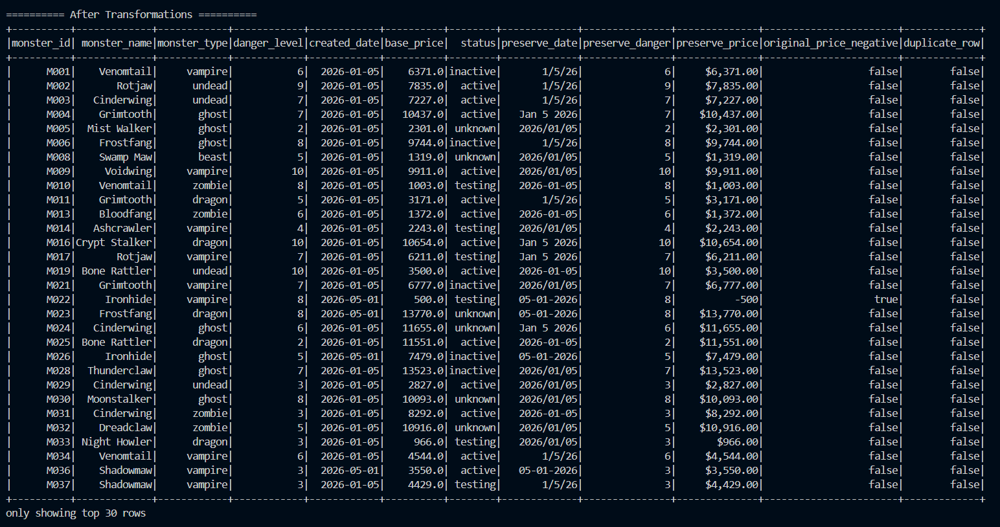
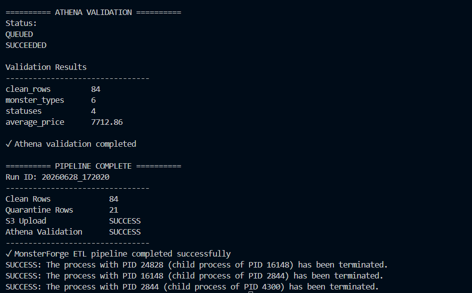

# MonsterForge AWS ETL Pipeline

> **An end-to-end AWS Data Engineering project demonstrating a production-style ETL pipeline built with PySpark, Amazon S3, AWS Glue, Amazon Athena, and boto3.**

---

## Project Highlights

* End-to-end ETL pipeline using PySpark
* Automated data quality validation
* Clean / Quarantine data processing
* Versioned data lake architecture (`latest` + `run_id`)
* AWS Glue Data Catalog automation
* Amazon Athena validation queries
* Modular, reusable Python design
* Centralized AWS error handling

---

## Architecture

## AWS Architecture Screenshots

## Pipeline Features & AWS Integration

* Amazon S3 uploads
* Object verification
* Versioned storage
* AWS Glue crawler automation
* AWS Glue Data Catalog
* Amazon Athena validation

### Data Quality

* Header normalization
* Whitespace trimming
* Blank value normalization
* Duplicate detection
* Invalid record quarantine
* Multi-format date parsing
* Currency normalization
* Negative value correction
* Data type validation

## Example Pipeline Output

## Technologies

| Category        | Technology    |
| --------------- | ------------- |
| Language        | Python        |
| Processing      | PySpark       |
| Cloud           | AWS           |
| Storage         | Amazon S3     |
| Catalog         | AWS Glue      |
| Query Engine    | Amazon Athena |
| SDK             | boto3         |
| Version Control | Git & GitHub  |

---

## Engineering Decisions

A few design decisions intentionally mirror production ETL pipelines:

* Every pipeline execution generates a unique `run_id` for data lineage.
* Clean and quarantined datasets are written independently.
* The `latest` folder provides easy access to the newest successful dataset.
* Historical pipeline runs remain available for auditing.
* All AWS interactions are centralized through a reusable error-handling wrapper.
* Athena is used as the final validation step after the Glue Data Catalog is updated.

---

## Future Enhancements

Planned improvements include:

* Environment-based configuration
* Structured logging
* Automated quality report generation
* Apache Airflow orchestration
* AWS Lambda event triggers
* Amazon Redshift integration
* Infrastructure as Code (Terraform)

---

## About

This project was built as part of my transition into Data Engineering with the goal of demonstrating practical experience designing, automating, and validating cloud-native ETL pipelines using modern AWS services.

The focus of this repository is on building reliable, maintainable, and production-oriented data engineering workflows rather than performing downstream analytics.
